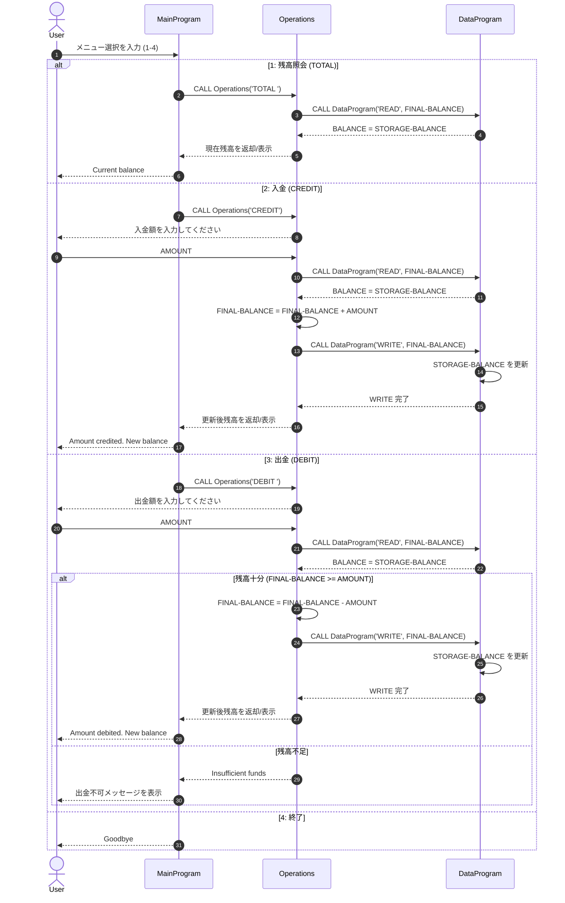

# COBOL 学生口座システム ドキュメント

## 概要
このドキュメントでは、[src/cobol/](../src/cobol/) 配下にある COBOL モジュールについて、学生口座管理のシンプルな処理フローとして説明します。

本システムで提供している機能は次のとおりです。
- 残高照会
- 入金（クレジット）
- 出金（デビット、残高チェックあり）

## COBOL ファイルの役割

### [main.cob](../src/cobol/main.cob)
**Program ID:** `MainProgram`

**目的:**
- アプリケーションのエントリーポイントです。
- 対話型メニューを表示し、ユーザーの選択を業務処理モジュールに振り分けます。

**主な機能:**
- ユーザーが終了を選ぶまでメニューを繰り返します。
- 1〜4 のメニュー入力を受け付けます。
- 操作コードを指定して `Operations` を呼び出します。
  - `TOTAL `: 残高照会
  - `CREDIT`: 入金処理
  - `DEBIT `: 出金処理
- 不正な入力の場合はエラーメッセージを表示します。

### [operations.cob](../src/cobol/operations.cob)
**Program ID:** `Operations`

**目的:**
- 残高照会・入金・出金のトランザクション処理を実装します。
- 画面メニューとデータ保持の間にある業務ロジック層として動作します。

**主な機能:**
- リンケージ項目（`PASSED-OPERATION`）から操作種別を受け取ります。
- `TOTAL ` の場合:
  - `READ` 指定で `DataProgram` を呼び出します。
  - 現在残高を表示します。
- `CREDIT` の場合:
  - 入金額を入力させます。
  - 現在残高を読み込みます。
  - 入力額を残高へ加算します。
  - `WRITE` で更新後残高を書き戻します。
- `DEBIT ` の場合:
  - 出金額を入力させます。
  - 現在残高を読み込みます。
  - `FINAL-BALANCE >= AMOUNT` を満たすか判定します。
  - 条件を満たす場合は減算し、更新後残高を書き戻します。
  - 条件を満たさない場合は残高不足メッセージを表示します。

### [data.cob](../src/cobol/data.cob)
**Program ID:** `DataProgram`

**目的:**
- 他プログラムから参照・更新される口座残高の状態を保持します。
- 操作コードベースの最小限の読み書きインターフェースを提供します。

**主な機能:**
- ワーキングストレージ（`STORAGE-BALANCE`）に口座残高を保持します。
- リンケージ経由で操作コードと残高変数を受け取ります。
- `READ` の場合:
  - 保持している残高を呼び出し元へ返します。
- `WRITE` の場合:
  - 呼び出し元から受け取った残高で保持値を更新します。

## 学生口座に関する業務ルール

現在の COBOL ロジックには、次の業務ルールが実装されています。

1. 単一口座モデル
- 実行中コンテキストでは、残高値（`STORAGE-BALANCE`）を 1 つだけ管理します。
- 現在の実装には学生 ID や複数口座の分離はありません。

2. 初期残高
- 初期残高は `1000.00` です。

3. 入金ルール
- 入力した入金額を現在残高にそのまま加算します。
- 更新後残高は直ちに書き戻されます。

4. 出金ルールと残高保護
- 出金は、残高が出金額以上の場合にのみ許可されます。
- 残高不足の場合は書き込みを行わず、残高は変更されません。

5. 永続化の範囲
- 残高はプログラムのワーキングストレージに保持されるため、永続化は実行中メモリ内に限定されます。
- 外部ファイルやデータベースへの保存は実装されていません。

6. 固定コードによる処理分岐
- プログラム間呼び出しは固定長の操作コード（`TOTAL `、`CREDIT`、`DEBIT `、`READ`、`WRITE`）に依存します。
- 6 文字項目では末尾スペースが意味を持ちます。

## 将来のモダナイゼーションに向けたメモ

学生口座ユースケースとして、次の改善が考えられます。
- 学生識別子を導入し、複数口座を扱えるようにする。
- 入金額・出金額の不正値（負数など）を検証する。
- 取引ログと監査履歴を導入する。
- 残高を永続ストレージ（ファイルまたはデータベース）へ保存する。
- モジュール間のエラーハンドリングを標準化する。

## シーケンス図（データフロー）

